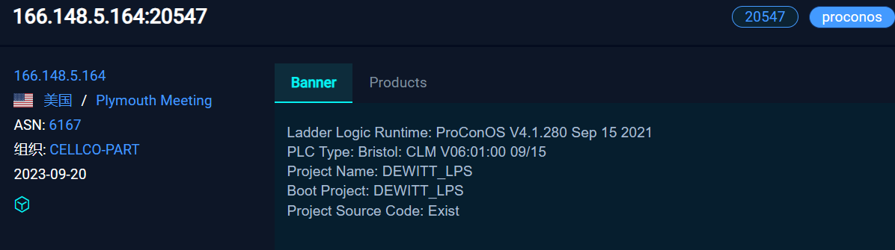
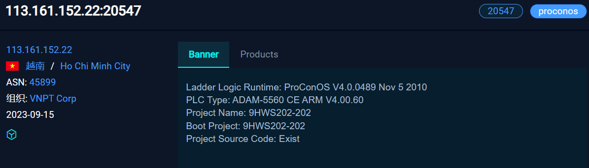
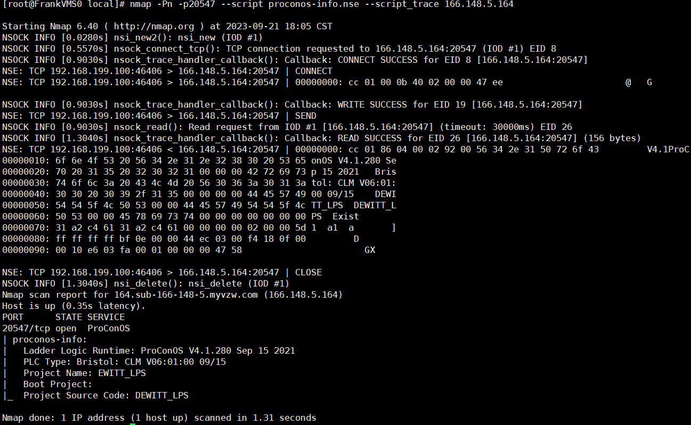
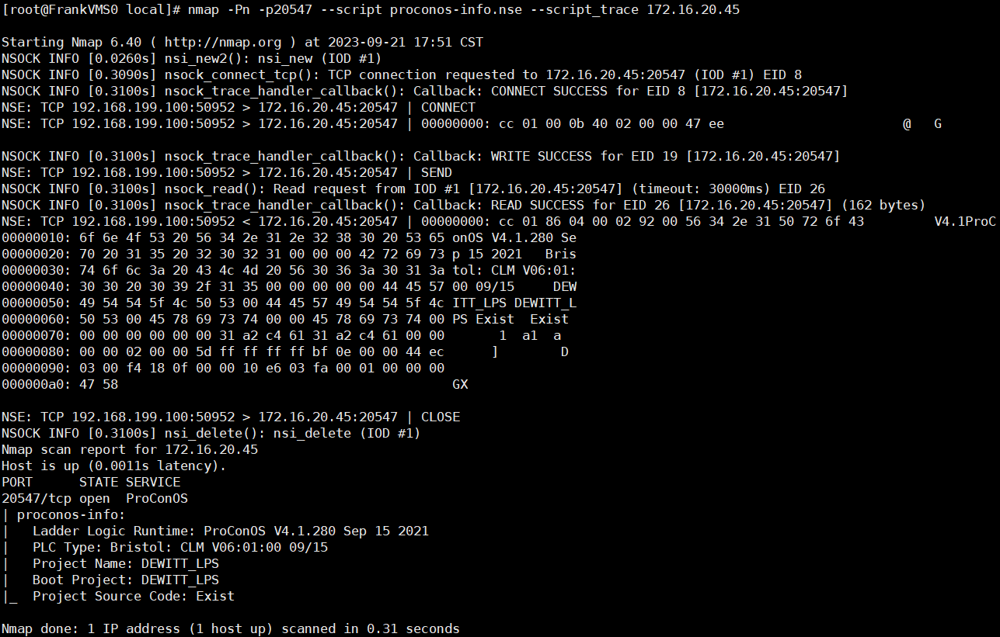
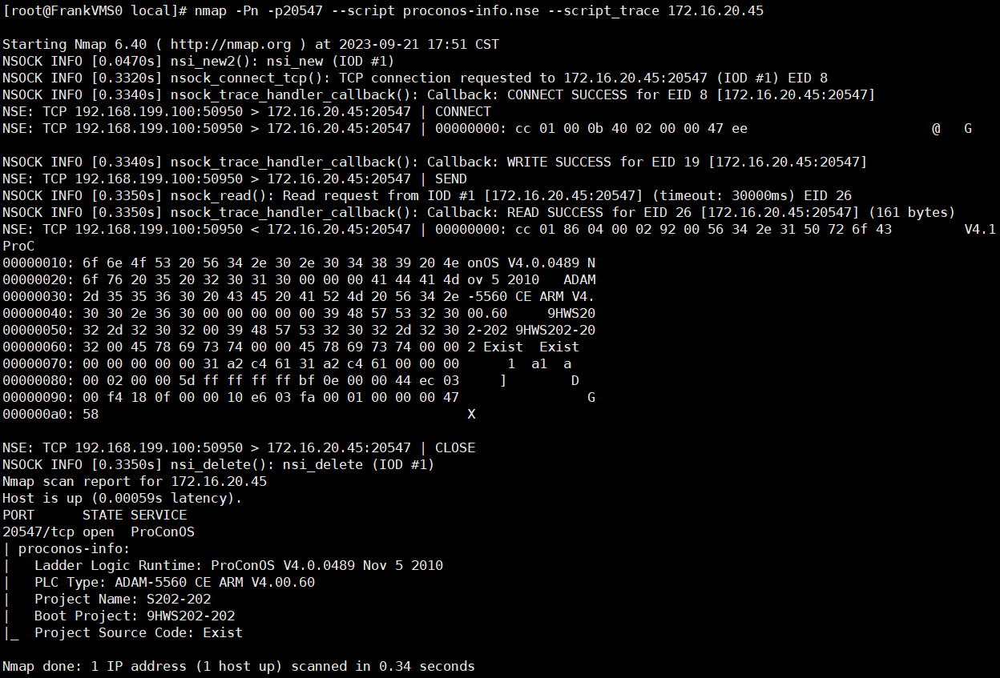

### 思路
模拟一个支持ProConOS协议的设备，当nmap扫描的时候，返回真实ProConOS协议的banner。
### 实现
1. 用户在命令行指定ProConOS设备的配置 `go run main.go -config 配置文件路径`。
2. 指定配置后，解析配置文件内容，得到要返回的banner信息。然后开启一个socket监听20547端口。
3. 当nmap扫描这个端口时，模拟真实ProConOS设备返回正确的数据，欺骗nmap。
### 样例设备配置
config1.json 配置相关字段

config2.json 配置相关字段

### nmap扫描样例设备1

### nmap扫描配置文件1

# ===================================================
### nmap扫描样例设备2

### nmap扫描配置文件2

